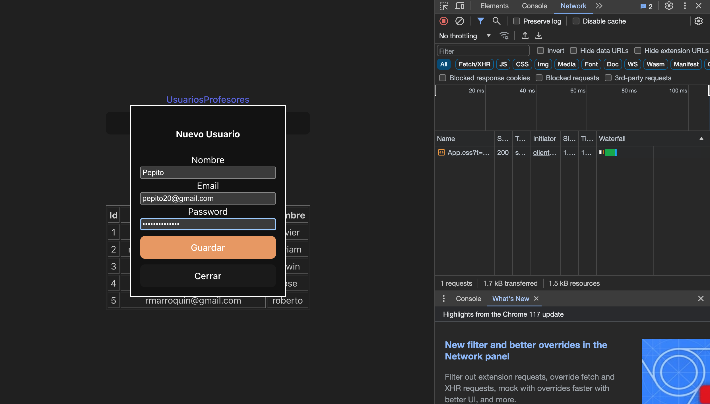
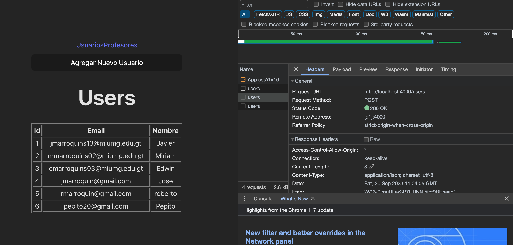
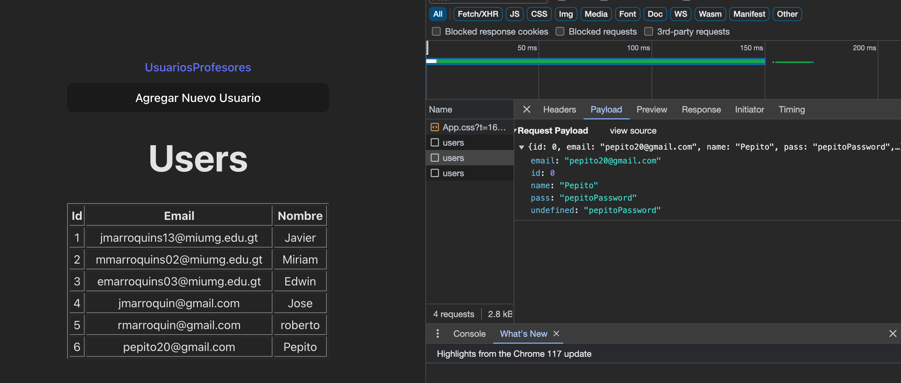
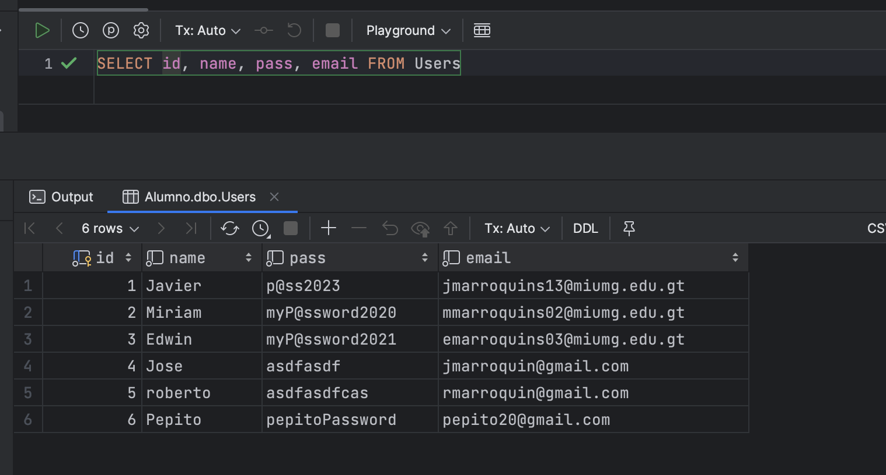

<h1>Intregracion API y Frontend</h1>
<ol>
<li>Correr en su maquina y configurar su servidor API basado en el material de la clase 9 extra.</li>
<li>Agregar estilos CSS para mejorar la calidad visual de la Aplicacion.</li>
<li>Compartir su enlace de Github con pantallazos de la aplicacion corriendo.</li>
<ol>

